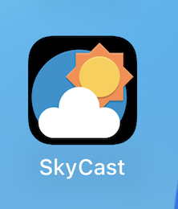
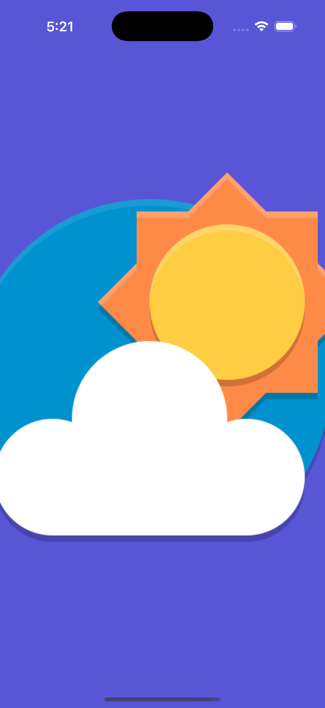

## Skycast
Skycast is a simple weather prediction app in SwiftUI

## Prerequisites:
* XCode 16.2+
* iOS version: 16+

## APIs Docs
*  [API Used](http://api.weatherapi.com/v1/current.json) -> query = q & api_key = key 
* [API Documentation](https://www.weatherapi.com/docs/)

## Requirements:
* Ability to search a city and select to show weather report
* Save last saved city 
* No city saved should should prompt user to search 
* Handle errors gracefully 

## Screenshots:
| Search Result | Empty State | Error |  
|-|-|-|
| |  |  |

| No Internet | Saved City | Typing |
|-|-|-|
|  |  |  |

| App Icon | Splash Screen |
|-|-|
|  |  |

## Video 
<video width=200 src="https://github.com/user-attachments/assets/a688aa66-4733-4410-8f68-8c3007c8cbea
" controls width="600"></video>
